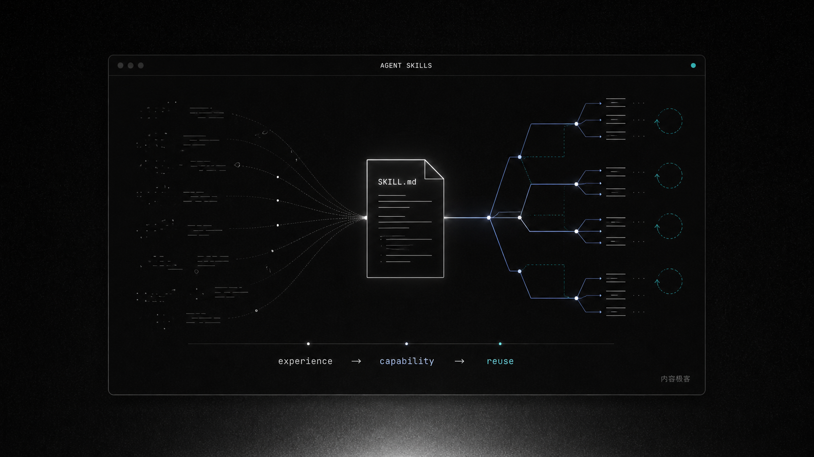

[](README.md) [](README.zh-CN.md)

# ClaudeSkills

ClaudeSkills 是一个 Agent Skills 合集：13 个按标准 `SKILL.md` 格式写的Skills合集。每个 Skill 按照Skills 2.0标准重构，经过多次重写和打磨（目前Deep Research已经迭代了8个主要版本，Deck studio已经迭代了三个主要大版本），获得了用户的一致好评，支持 Agent Skills 的客户端都能装、都能用。

Skills 是让你的经验实现复利的关键：Prompts 是一次性调用，而 Skills 实现了能力的可持续复用。 本项目基于对 Multi-Agents 架构的深度理解而构建，旨在最大限度地发挥 Agent 的潜力。感谢社区的鞭策与喜爱，这是我们持续维护和迭代的动力。目前，本项目中的技能已被多个 Skill Hub 类网站收录，方便您在不同平台同步使用。

[](https://github.com/staruhub/ClaudeSkills/actions/workflows/validate.yml)
[](https://github.com/staruhub/ClaudeSkills/releases/tag/1.0.1)
[](LICENSE)

**目录**：[快速开始](#快速开始) · [Skill 列表](#skill-列表) · [验证](#验证) · [安装选项](#安装选项) · [贡献](#贡献)

[官网](https://staruhub.github.io/ClaudeSkills/) · [1.0.1 发布说明](https://github.com/staruhub/ClaudeSkills/releases/tag/1.0.1) · [安全说明](SECURITY.md)

<p align="center">
  
</p>

## 快速开始

本项目和其他开源项目一样，都可以使用git clone指令进行克隆，比如 deck-studio：

```bash
git clone --depth 1 https://github.com/staruhub/ClaudeSkills.git && cd ClaudeSkills
python3 scripts/install_skill.py deck-studio
```
当然，我们也处于一个Agent时代，你可以直接给Agent说：
```text
帮我安装https://github.com/staruhub/ClaudeSkills项目中的ppt skills.
```

装完直接跟你的 Agent 说：

```text
使用 deck-studio，把这份季度复盘做成一套 8 页的咨询风汇报
```

默认装到 `~/.agents/skills/`，一般的Agents（例如Claude Code，ChatGPT）都扫描这个目录。其他安装方式见[安装选项](#安装选项)。

## Skill 列表

四个精心打磨的高品质skills：

| Skill | 干什么 |
|---|---|
| [`deep-research`](skills/Geek-skills-deep-research/SKILL.md) |深度研究： 从精准圈定边界、协同搜集资料，到建立溯源档案、交叉验证引用，最终交付一份来源清晰、并坦诚局限的深度报告。包含完整可验证的来源，拒绝AI幻觉。 |
| [`product-manager`](skills/Geek-skills-product-manager/SKILL.md) | 想法打磨器 (Grill-to-Doc)： 基于项目现状，通过一轮一轮的追问，将你的模糊想法锤炼成具体的产品文档 (PRD)。严格遵循“文档先行”原则，文档不定稿，代码不动工。支持断点续聊。 |
| [`deck-studio`](skills/Geek-skills-deck-studio/SKILL.md) | PPT工作室 (Deck Studio)： 从对齐核心大纲、敲定单页简报，到应用视觉模板、完成最终走查。交付物可选纯文字内容稿，或附带视觉建议的逐页设计稿 (Mockup)。 |
| [`wechat-article-writer`](skills/Geek-skills-wechat-article-writer/SKILL.md) | 公众号爆文神器（可能是比卡兹克更加早的推出卡兹克风格的skills）： 一站式生成文章正文、AI配图提示词、和适配微信的排版HTML。既可单篇使用，也可作为创作流水线的一个环节无缝衔接。(免责声明：仅生成内容，不负责发布。) |

九个专业技能：

<details>
<summary><b>展开</b></summary>

| Skill | 干什么 |
|---|---|
| [`pair-programming`](skills/Geek-skills-pair-programming/SKILL.md) | 结对编程 (Pair Programming)： 辅助编码，并进行结构化自审，专治 AI 代码的常见毛病。 |
| [`security-audit`](skills/Geek-skills-security-audit/SKILL.md) | 安全审计 (Security Audit)： 审计代码与依赖库，排查潜在安全漏洞。 |
| [`solution-architect`](skills/Geek-skills-solution-architect/SKILL.md) | 解决方案架构 (Solution Architect)： 辅助进行系统设计、技术选型与架构评审。 |
| [`threejs-performance`](skills/Geek-skills-threejs-performance/SKILL.md) | Three.js 性能优化： 深入排查并优化 Three.js 应用的性能瓶颈。 |
| [`mineru-pdf-parser`](skills/Geek-skills-mineru-pdf-parser/SKILL.md) | 本地 PDF 解析： 调用本地 MinerU 工具，将 PDF 精准解析为 Markdown 或 JSON 格式。 |
| [`ai-sales-champion`](skills/Geek-skills-ai-sales-champion/SKILL.md) | AI 销售冠军： 将复杂的技术能力，翻译成客户一听就懂的商业价值。 |
| [`keqian-method`](skills/Geek-skills-keqian-method/SKILL.md) | “克谦老师”方法论： 实现基于单一 Agent、SDD 和质量门禁的 AI 产品开发流程。 |
| [`xuefeng-method`](skills/Geek-skills-xuefeng-method/SKILL.md) | 行为开放、模型驱动的 AI Native 产品方法 |
| [`c-drive-cleaner`](skills/Geek-skills-c-drive-cleaner/SKILL.md) | C 盘清理大师： 智能分析并清理 Windows C 盘。默认启用“演习模式”，安全第一。 |

</details>

实验性的（备考、天气报告、播客生成等）在 [`lab/`](lab/)，不计入精选范围，也不遵循相同的验证标准。

## 验证

所有可自动化的检查项均已脚本化，可随时运行以自我验证：

```bash
python3 scripts/validate.py                  # 13 个精选 Skill 的结构检查
python3 scripts/run_routing_evals.py         # 91 条路由用例
python3 tests/task_b/run_contract_tests.py   # 四个旗舰的 17 个契约用例
```

我们同样提供了可供检查的成品。deck-studio 的生成脚本、渲染结果、评分标准及评审意见均已开源。以下是 17 种风格中的 4 种预览：

<p align="center">
   
</p>

样例：[构成主义](skills/Geek-skills-deck-studio/examples/constructivist-design-constitution/) · [墨白咨询报告](skills/Geek-skills-deck-studio/examples/moshiro-consulting-report/) · [英黄训练营提案](skills/Geek-skills-deck-studio/examples/yinghuang-bootcamp-proposal/) · [极夜 AI Native](skills/Geek-skills-deck-studio/examples/polar-night-ai-native/)

自测分数：构成主义样例按仓库的评分标准获得 7.1/10；三评委对调位置对比，42.3 对 29.7。所有过程和数据均在仓库中，可供复现。

<details>
<summary><b>每项检查能证明什么、证明不了什么</b></summary>

| 检查 | 能证明 | 证明不了 |
|---|---|---|
| `run_contract_tests.py` | 17 个固定用例，覆盖四个旗舰 Skill 的正常、恢复、失败路径；Deck 另跑真实 Chrome 渲染和 PPTX 组装 | 更换模型后的输出质量、真实出图效果、微信平台实际发布情况 |
| `validate.py` | 13 个精选 Skill 的目录结构符合仓库约定 | 每个 Skill 都在真实业务中经过端到端（E2E）测试 |
| `run_routing_evals.py` | 10 个 Skill、91 条路由用例的 schema、目标、唯一性、冲突检查通过 | 大模型真实执行时的路由准确率 |
| Python / Node 编译检查 | 仓库的 13 个 Python、7 个 JavaScript 文件都能解析 | 网络、外部工具的可用性，以及生产环境的稳定性 |

完整记录在 [`verification/2026-07-31/README.md`](verification/2026-07-31/README.md)。

</details>

## 安装选项

<details>
<summary><b>展开</b></summary>

```bash
python3 scripts/install_skill.py --list                  # 查看全部短名
python3 scripts/install_skill.py deep-research           # 装任意一个
python3 scripts/install_skill.py deep-research --project # 只装到当前项目
python3 scripts/install_skill.py deep-research --client claude-code # Claude Code 目录
cp -r skills/Geek-skills-deep-research ~/.agents/skills/deep-research # 手动复制，目录名即 Skill 名
```

```bash
git pull && python3 scripts/install_skill.py deck-studio --force   # 更新
rm -rf ~/.agents/skills/deck-studio                                # 卸载
```

常见问题：

- 装了没被发现： 请确认您的 Agent 客户端扫描的是否为 ~/.agents/skills/ 目录。如果不是，请使用其原生目录进行安装。
- 不自动触发： 在您的请求中明确点名 Skill。不同客户端的触发方式各异，有的支持自然语言，有的需要使用斜杠命令。
- 更新后需重装： git pull 更新的是仓库本身，已安装的 Skill 是副本，需要重新运行安装命令进行更新。

</details>

## 贡献

我们欢迎任何形式的贡献：发现 Bug、分享使用成果，或提出改进建议，都请大胆提交，欢迎[提 issue](https://github.com/staruhub/ClaudeSkills/issues)，提交时请附上脱敏的输入、产出和复现步骤。如果您想添加新的 Skill，请先阅读 [CONTRIBUTING.md](CONTRIBUTING.md)：先进 [`lab/`](lab/)，通过所有检查后方可进入精选列表。

如果觉得这个项目对您有帮助，请不吝点亮一个 Star ⭐。用于微信群或社交媒体宣传的图片和文案已为您准备好，请在 [`assets/social/`](assets/social/)，中取用。

## 安全

每个 Skill 的文件读取权限、网络访问、命令执行、凭证使用等安全相关信息，都已在  [`SECURITY.md`](SECURITY.md)中说明。

## License

[MIT](LICENSE)
